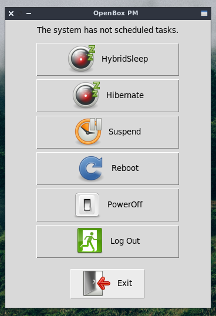

# openboxpm

**openboxpm** - it is very simply power manager for OpenBox.
It allows you to perform with PC such operations as:
1. PowerOff
2. Reboot
3. Suspend
4. Hibernate
5. HybridSleep
6. Log out from OpenBox session

In self work it interacts with D-Bus through `dbus` Python module.

Example:

